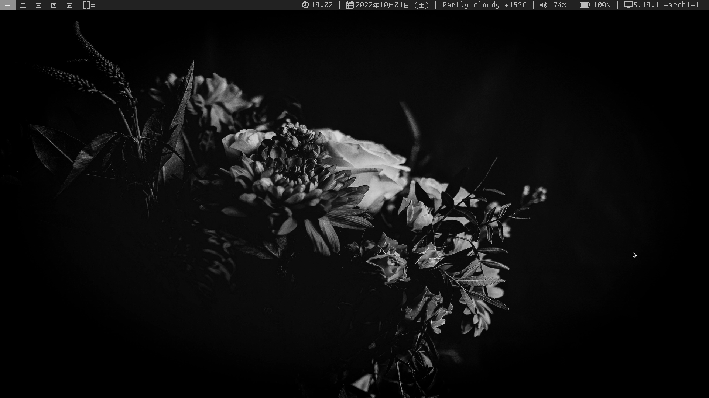
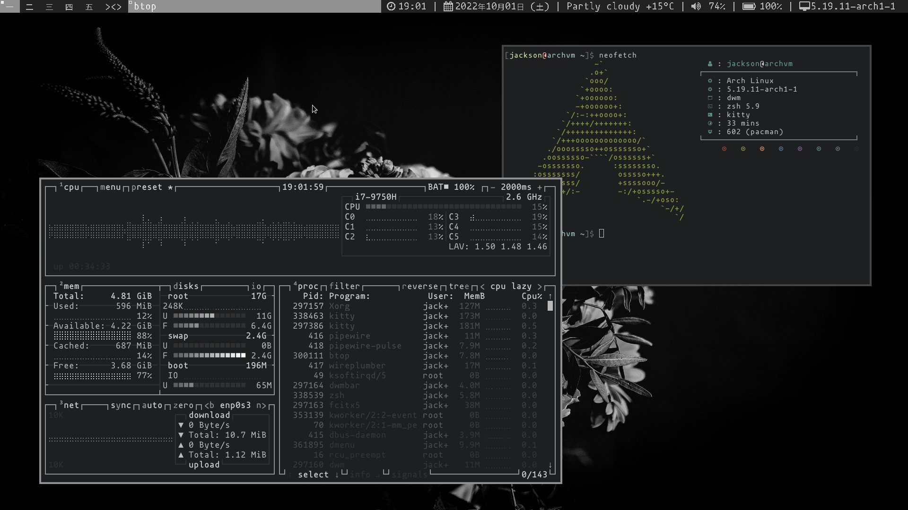
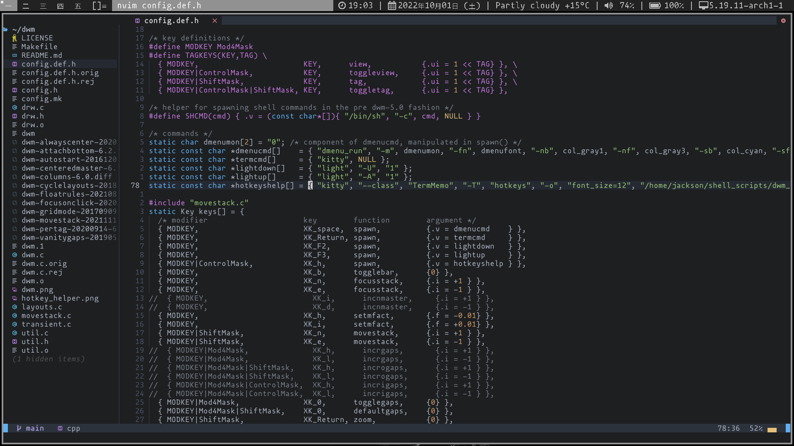

# My Personal Set of dotfiles (Arch btw)
A nice and minimal setup with a very utilitarian theme. All monochrome because its really nice.

## Whats being used (These are all installed with the script)
Look at `install.sh`, it has everything there.

Notes:
It is required that X11 is used, I can't be bothered with wayland and I just used the `archinstall` script and picking the `xorg` option at the end of the install.

## Window manager
I use dwm for this, it is at [this repository](https://github.com/JumpyJacko/dwm).
I also use my fork of thytom/dwmbar at [this repository](https://github.com/JumpyJacko/dwmbar).

## Installation (from clean install)
Get and run `install.sh` script. (Requires no input until end of script where `paru` is being compiled)
```bash
curl -LJo install1.sh https://raw.githubusercontent.com/JumpyJacko/dotfiles/main/install.sh
# cat or whatever out install1.sh just to make sure its correct
bash ./install1.sh

# After the script is done
rm install1.sh
```

## Gallery



