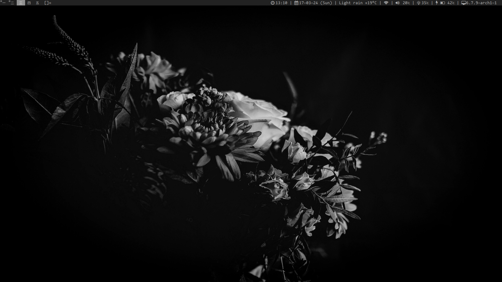
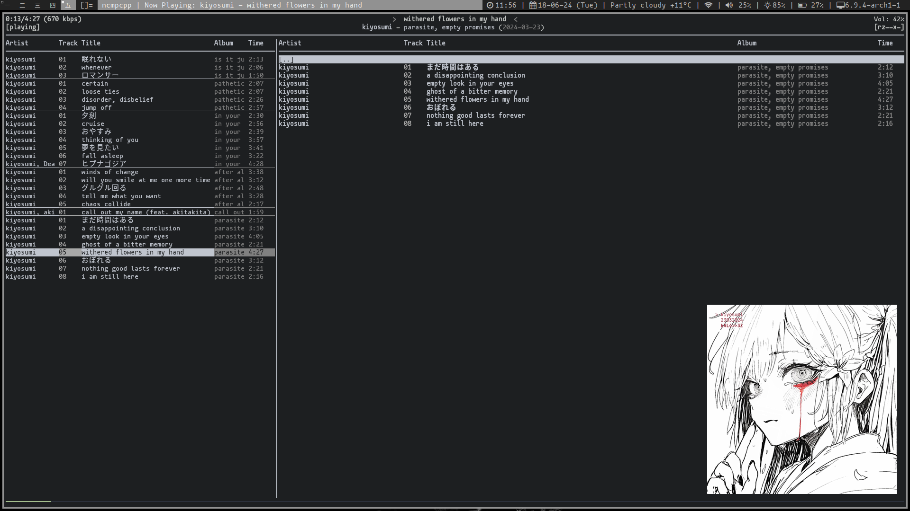

# dotfiles
A nice and minimal setup that does everything I need, with a very simple theme.

## How could I go about and use these?
Read [INSTALL.md](https://github.com/jumpyjacko/dotfiles/blob/main/INSTALL.md).
> Note: Mostly filled with commands for me so that I don't have to remember what I need.

## Window manager
I use dwm for this, it is at [this repository](https://github.com/jumpyjacko/dwm).
I also use my fork of thytom/dwmbar at [this repository](https://github.com/jumpyjacko/dwmbar).

## Neovim
I use my own Neovim configs that uses the [lazy.nvim](https://github.com/folke/lazy.nvim) plugin manager and found at [this repo](https://github.com/jumpyjacko/nvim).

## Gallery

### Extras

